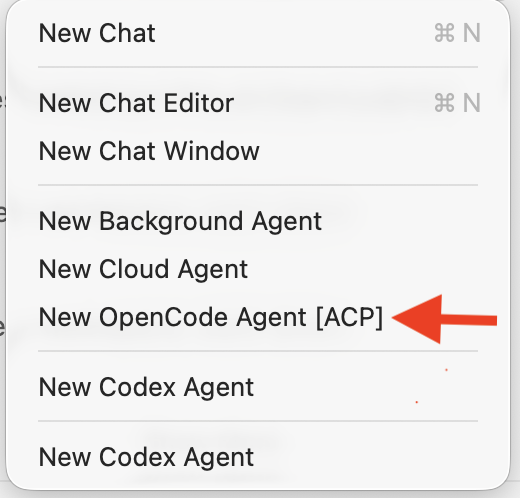

# VS Code ACP Client Extension

[](https://code.visualstudio.com/)
[](https://www.typescriptlang.org/)
[](https://agentclientprotocol.com/)
[](LICENSE)

> Disclaimer: Some of the code in this extension is generated by AI.

> Experimental

Native chat session provider for VS Code that connects external agent CLIs through the Agent Client Protocol (ACP).

## Features

- Adds support for ACP agents in VS Code as external agents
- Supports
  - [OpenCode](https://opencode.ai)
  - [cagent](https://docs.docker.com/ai/cagent/)
  - [Codex CLI](https://github.com/openai/codex) through [https://github.com/zed-industries/codex-acp](https://github.com/zed-industries/codex-acp)
  - [Gemini CLI](https://geminicli.com)

## Configuration

Add ACP agents under the `acpClient.agents` setting (User or Workspace) to surface them in the chat session picker. You can also provide optional MCP tool connections via `mcpServers` so the agent automatically connects to additional tools when sessions start. **MCP support is currently limited to `stdio` transports**, so each entry must include the command to launch the tool and any arguments or environment variables it needs:

```json
"acpClient.agents": {
  "cagent": {
    "label": "Docker cagent",
    "command": "/opt/bin/cagent",
    "args": [
      "acp",
      "/agents/coding.yaml"
    ],
    "mcpServers": [
      {
        "type": "stdio",
        "name": "workspace-tools",
        "command": "/opt/bin/mcp-tool",
        "args": ["serve"],
        "env": {
          "WORKSPACE": "${workspaceFolder}"
        }
      }
    ],
    "enabled": false
  },
  "opencode": {
    "label": "OpenCode Agent",
    "command": "/opt/bin/opencode",
    "args": [
      "acp"
    ],
    "mcpServers": [],
    "enabled": true
  }
}
```

## Installing

At the moment the extension is under development, so this is not yet published into VSCode market place. But if you want to try out as it is you can install the extension by building it locally and installing into your **VSCode Insider** since this extension relies on some of the experimental APIs only available in VSCode Insider.

To build the extension locally you can follow these steps:

1. Clone the repository

   ```bash
   git clone https://github.com/gayanper/vscode-acp-provider.git
   ```

2. Navigate to the project directory

   ```bash
   cd vscode-acp-provider
   ```

3. Install the dependencies

   ```bash
   bun install
   ```

4. Build the extension

   ```bash
   bun run package
   ```

5. Open VSCode Insider and install the extension
   - Open the command palette (Ctrl+Shift+P or Cmd+Shift+P on Mac)
   - Type `Extensions: Install from VSIX...` and select it
   - Browse to the location of the built `.vsix` file (usually in the `vscode-acp-provider` directory) and select it to install

6. Configure Runtime Arguments to enable proposed API for this extension
   - Open the command palette (Ctrl+Shift+P or Cmd+Shift+P on Mac)
   - Type `Preferences: Configure Runtime Arguments` and select it
   - Add the following line to the `argv.json` file that opens:

     ```json
     "enable-proposed-api": ["org-gap.vscode-acp-client"]
     ```

   - Save the file and restart VSCode Insider

## Usage

After configuring you should see the configured agents in the chat session picker. Select one to start a new chat session with the external agent.

